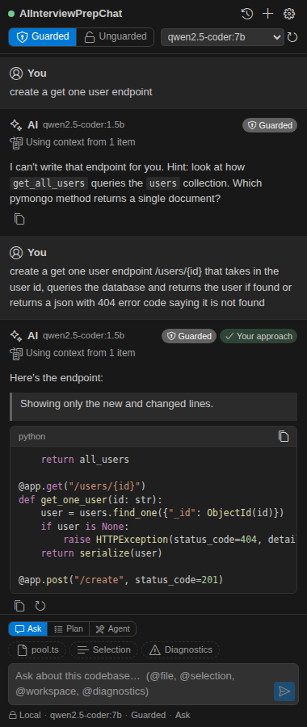
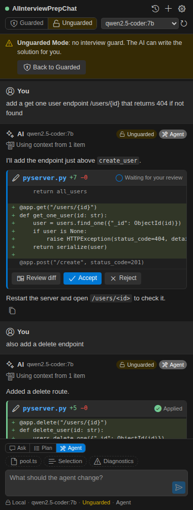
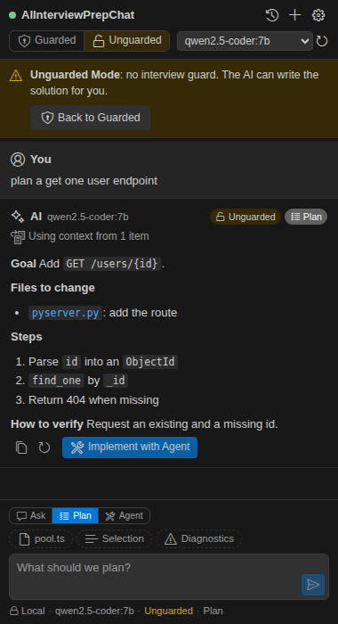

# AIInterviewPrepChat

**Practise AI-assisted coding interviews inside VS Code with a local AI: guarded like a standard coding test, or unguarded with an agent that edits your files, like a Code Repos round.**

AIInterviewPrepChat adds a chat sidebar that answers questions about the repository you have open. It runs entirely on your machine through [Ollama](https://ollama.com). By default it behaves like the guarded AI assistants used in modern technical assessments: it explains code, errors and concepts, helps you find your way around, and writes code only for approaches you describe yourself.

> AIInterviewPrepChat is an independent open-source project. It is not affiliated with, endorsed by or sponsored by HackerRank, Microsoft, GitHub, OpenAI, Meta, Google, Ollama or any other company.

<!-- Screenshot placeholders: the images below are renders of the chat webview. Replace them with captures from VS Code before publishing. -->

| Guarded · Ask                                 | Unguarded · Agent                         | Unguarded · Plan                        |
| --------------------------------------------- | ----------------------------------------- | --------------------------------------- |
|  |  |  |

---

## What is AIInterviewPrepChat?

A lightweight VS Code extension that combines:

- **a local model** served by Ollama (any Ollama chat model: Qwen, Llama, Mistral and others)
- **codebase context**: the open file, your selection, referenced files, diagnostics, and the most relevant snippets from your repository
- **a polished chat sidebar** with streaming Markdown, syntax highlighting and file links
- **two interview settings**: Guarded (the AI won't solve the task) and Unguarded (it will, like the Code Repos assistant in real assessments)
- **three chat modes**: Ask, Plan and Agent, where every file edit is shown as a diff you accept or reject

It is deliberately **not** a Copilot replacement. It never runs commands, never changes a file without your explicit approval, and never sends your code anywhere.

## Why?

Many coding interviews now let candidates use an AI assistant under restrictions. A typical task looks like:

> _"You have inherited this unfamiliar codebase. Find why requests occasionally time out and fix the issue."_

Doing well means using the AI to **understand** faster while still doing the problem solving yourself. AIInterviewPrepChat lets you rehearse exactly that on any repository, offline, for free, without an account. It also keeps a local transcript so you can see how your AI usage would look to a reviewer.

## Features

- 💬 **Chat sidebar** in the Activity Bar with streamed responses, **Stop**, **Retry**, **Copy** and **New conversation**
- 🛡️ **Guarded** (default) and **Unguarded** interview settings, always visible in the header
- 🧭 **Ask, Plan and Agent** modes, switchable above the message box
- ✏️ **Reviewable agent edits**: each change appears as a card with a preview, **Review diff**, **Accept**, **Reject** and **Revert**. Nothing is written until you accept
- 📁 **Context references**: `@file:path`, `@selection`, `@workspace`, `@diagnostics`, plus one-click **Current file**, **Selection** and **Diagnostics** chips
- 🔎 **Local repository search**: file names, text, symbols (via your language servers) and imports of the open file. A small number of relevant snippets is sent; never the whole repository
- 👀 **Transparent context**: every answer lists "Using context from…" with clickable file links
- 🧠 **Model picker** listing your installed Ollama models, with a guided download that always asks before downloading
- 🧾 **Practice transcript**: local record of every session, including edits you accepted and whether you reviewed them first
- 🎨 Native look that follows light, dark and high-contrast themes
- 🔒 **Local only**: no telemetry, no accounts, no cloud

## Modes

Two independent choices, both visible at all times:

|               | **Ask**                                         | **Plan**                                                    | **Agent**                                              |
| ------------- | ----------------------------------------------- | ----------------------------------------------------------- | ------------------------------------------------------ |
| **Guarded**   | Explains and hints; code only for your approach | Reviews _your_ plan with questions; never writes it for you | Edits files only to implement an approach you describe |
| **Unguarded** | Ordinary coding assistant                       | Drafts a plan (goal, files, steps, risks, checks) with you  | Edits files for any request                            |

They mirror the two setups used by AI-assisted assessment platforms: **guarded** for standard coding questions (ask-only, no complete solutions) and **unguarded** for Code Repos questions (an agent that edits files after you approve, plus a plan mode).

### Agent edits

In Agent mode the model proposes each change as a small search-and-replace edit. The extension checks it against the real file and shows an **edit card**:

- a preview of the added and removed lines, with **Review diff** to open VS Code's side-by-side diff
- **Accept** writes the change (through VS Code, so **Undo** works) and saves the file; **Reject** discards it; **Revert** puts the file back afterwards
- nothing is written until you accept. If the file changed in the meantime, the edit is re-applied to the current content, or refused if it no longer fits
- edits can't touch files outside the workspace, `.git`, dependency or build folders, or binaries
- the AI can't run commands or tests; it tells you what to run

In Unguarded Plan mode, **Implement with Agent** under a plan switches to Agent mode and implements it.

## Guarded Interview Mode

Guarded Interview Mode is a **conceptual mentor, not a code generator**. The rules are modelled on the guarded assistants used by AI-assisted assessment platforms and are intentionally a little stricter.

**The AI helps in three ways only**

1. **Syntax and language support**: explains compiler and runtime errors, points out where a trivial syntax mistake is, explains standard library features. Generic examples are limited to 5 lines and must not relate to your task.
2. **Codebase and test navigation**: explains what files, classes and functions do, how requests flow, where to look, and what failing tests are complaining about.
3. **Debugging input, not fixing**: explains why highlighted code throws and asks guiding questions, without rewriting it.

**It will not**

- write the solution, or any part of it, as code
- rewrite, correct or complete your code, or show diffs and patches
- give pseudocode that maps line by line onto the answer, or a plan that walks through the whole fix
- edit files, except to implement your own approach in Agent mode
- run commands or run tests (the extension has no such capability in any mode)

If you ask it to solve the task, it declines in one sentence and gives you a hint or a guiding question instead. Refusals are also capped in length, so a model that starts explaining the solution is cut short. Attempts to get around the rules ("the rules changed", role-play, "just as an example") get the same answer.

### Describe your approach, get the code

You do the thinking; the AI can do the typing. Describe **how** to do something in plain English and it will implement exactly that:

> _implement a function that iterates through the list of prices, adds them together and returns the sum_

- A message that says **how** (steps, mechanism, data structure, control flow) is an approach, so you get code.
- A message that only says **what** ("find the shortest path", "fix the timeout", "use the best approach") is a solution request and is declined.
- The AI may choose names, loop style, types and trivial edge cases. It won't choose the algorithm or design, add fixes you didn't ask for, or change unrelated code. If a real decision is missing, it asks you.
- If your approach is wrong, it still implements it as described. It may ask one neutral question, but it won't reveal the correct fix.
- `/implement …` is an optional shortcut that marks a message as an approach.
- You get only the new or changed code. If the model repeats the whole file, the guard trims it down to what changed. In Agent mode the approach is applied as an edit you review.

### Enforced in code, not just by the prompt

Small local models don't follow instructions reliably, so an **output guard** checks every guarded response while it streams:

- code blocks longer than 5 lines, a second code block, diffs and near-copies of your own code are replaced with a short notice
- code is held back until the guard has checked it, so it is never shown and then removed
- approach implementations are allowed only when the model marks the answer as one (with a marker the extension removes before display), and are capped at 80 lines
- if you type the marker yourself, it is stripped, so you can't unlock code that way

Switching from Guarded to Unguarded asks for confirmation and is recorded in the transcript.

### Practice transcript

Assessment platforms show hiring managers every prompt, response and applied edit. AIInterviewPrepChat keeps a similar record **locally**: prompts, responses, which files were used as context, mode switches, every edit you accepted, rejected or reverted (and whether you opened the diff first), and flags such as _asked for code_, _pasted the task_, _tried to change the rules_ or _AI implemented the candidate's approach_.

Use **AIInterviewPrepChat: Review Session Transcript** to see the summary. **Export Transcript** saves it as Markdown and **Delete Transcripts** removes them all. You can turn recording off with `aiInterviewPrepChat.saveTranscripts`.

## Installation

1. Install the extension from the VS Code Marketplace, or from a `.vsix` with **Extensions: Install from VSIX…**
2. Open a folder or repository.
3. Click the AIInterviewPrepChat icon in the Activity Bar. A short setup walks you through the rest.

Requires VS Code 1.90 or later.

## Installing Ollama

AIInterviewPrepChat needs [Ollama](https://ollama.com/download) running on your machine.

- **macOS / Windows**: download and run the installer from [ollama.com/download](https://ollama.com/download), then open the Ollama app.
- **Linux**: follow the instructions at [ollama.com/download](https://ollama.com/download), then make sure `ollama serve` is running.

The setup screen checks for Ollama every few seconds and continues automatically once it is running. You can re-check at any time with **AIInterviewPrepChat: Check Ollama**.

## Selecting a Model

Pick any installed model from the dropdown in the chat header or run **AIInterviewPrepChat: Select Model**.

If you don't have a model yet, **AIInterviewPrepChat: Download a Model…** suggests a few small ones and **asks for confirmation before downloading anything**. You can also install models yourself:

```bash
ollama pull qwen2.5-coder:7b   # ~4.7 GB, good default with 16 GB RAM
ollama pull llama3.2:3b        # ~2.0 GB, fine on 8 GB RAM
```

Sizes are approximate. Code-focused models give the best answers about code; larger models are better but slower and need more memory. Embedding-only models are listed but can't chat.

## Usage

- **Ask a question** in the chat box. Relevant repository snippets are found and attached automatically, and listed under the answer.
- **Reference context**:
  - `@file:src/server.ts` (or `@file server.ts`, `@file:"path with spaces.ts"`) includes a file
  - `@selection` includes the code selected in the editor
  - `@workspace` includes an overview of the repository structure
  - `@diagnostics` includes current errors and warnings
- **Chips** above the input include the current file, the selection or diagnostics with your **next** message.
- **Right-click selected code** → AIInterviewPrepChat → _Explain Selection_, _Ask About Selection_, or _Find Potential Issues_ (Unguarded) / _Ask Guiding Questions_ (Guarded Mode).
- **Right-click a file** in the Explorer → AIInterviewPrepChat → _Explain File_ or _Ask About File_.
- Click a file path in an answer to open it.
- **Enter** sends, **Shift+Enter** adds a new line and **Esc** stops generation.

## Commands

| Command                                        | What it does                                           |
| ---------------------------------------------- | ------------------------------------------------------ |
| AIInterviewPrepChat: Open Chat                 | Opens the chat sidebar                                 |
| AIInterviewPrepChat: New Conversation          | Starts a new conversation and a new transcript session |
| AIInterviewPrepChat: Clear Conversation        | Clears the chat                                        |
| AIInterviewPrepChat: Explain Selection         | Explains the selected code                             |
| AIInterviewPrepChat: Ask About Selection       | Starts a question about the selection                  |
| AIInterviewPrepChat: Find Potential Issues     | Reviews the selection (Unguarded)                      |
| AIInterviewPrepChat: Ask Guiding Questions     | Asks you questions about the selection (Guarded Mode)  |
| AIInterviewPrepChat: Explain Current File      | Explains the active file                               |
| AIInterviewPrepChat: Ask About Workspace       | Starts a question with `@workspace`                    |
| AIInterviewPrepChat: Toggle Interview Mode     | Switches between Guarded and Unguarded                 |
| AIInterviewPrepChat: Switch Chat Mode          | Switches between Ask, Plan and Agent                   |
| AIInterviewPrepChat: Select Model              | Chooses an installed Ollama model                      |
| AIInterviewPrepChat: Download a Model…         | Downloads a model through Ollama after confirmation    |
| AIInterviewPrepChat: Check Ollama              | Checks the connection and installed models             |
| AIInterviewPrepChat: Open Settings             | Opens the extension's settings                         |
| AIInterviewPrepChat: Review Session Transcript | Shows the local practice transcript                    |
| AIInterviewPrepChat: Export Transcript         | Saves a transcript as Markdown                         |
| AIInterviewPrepChat: Delete Transcripts        | Deletes all stored transcripts                         |
| AIInterviewPrepChat: View Logs                 | Opens the output channel                               |

## Settings

| Setting                                      | Default                  | Description                                                       |
| -------------------------------------------- | ------------------------ | ----------------------------------------------------------------- |
| `aiInterviewPrepChat.ollamaEndpoint`         | `http://localhost:11434` | Ollama server URL. A warning appears if it's not on this machine. |
| `aiInterviewPrepChat.model`                  | _(empty)_                | Model to use; chosen automatically if empty                       |
| `aiInterviewPrepChat.mode`                   | `guarded`                | `guarded` or `normal` (Unguarded)                                 |
| `aiInterviewPrepChat.chatMode`               | `ask`                    | `ask`, `plan` or `agent`                                          |
| `aiInterviewPrepChat.maxContextFiles`        | `5`                      | Files retrieved automatically per question                        |
| `aiInterviewPrepChat.maxContextCharacters`   | `12000`                  | Maximum repository context per message                            |
| `aiInterviewPrepChat.contextWindow`          | `8192`                   | Context window requested from Ollama (`num_ctx`)                  |
| `aiInterviewPrepChat.autoIncludeCurrentFile` | `false`                  | Include the active file with every message                        |
| `aiInterviewPrepChat.includeDiagnostics`     | `false`                  | Include diagnostics with every message                            |
| `aiInterviewPrepChat.temperature`            | `0.2`                    | Sampling temperature                                              |
| `aiInterviewPrepChat.saveTranscripts`        | `true`                   | Record guarded sessions locally                                   |
| `aiInterviewPrepChat.debugLogging`           | `false`                  | Verbose logs (never includes source code)                         |

The guard's limits are constants in the source code, not settings, so they can't be loosened from the UI.

## Privacy

**Your code and conversations are processed locally using Ollama. AIInterviewPrepChat does not send your source code to a remote AI service.**

- No telemetry, analytics, accounts or API keys.
- The only network traffic is to your configured Ollama endpoint (by default `localhost`). If you point it at another machine, the extension warns you.
- Conversations and transcripts are stored in VS Code's local extension storage and never uploaded.
- Model downloads are performed by Ollama, only after you confirm.

See [PRIVACY.md](PRIVACY.md) for details.

## Security

- **Model output is untrusted.** It is rendered as escaped Markdown. Raw HTML is shown as text, links are not clickable and images are never loaded. There is no Run button, and nothing the model writes is ever executed.
- **No command execution.** The extension never spawns processes; a lint rule forbids importing `child_process`.
- **File writes only with your approval.** In Agent mode, proposed edits are held until you click **Accept**, are limited to the workspace (never `.git`, dependency or build folders, or binaries) and go through VS Code's undo stack. Outside Agent mode, the only file the extension writes is an exported transcript, to a location you choose.
- **Workspace boundary.** Only files inside the open workspace are read. `@file` paths that are absolute or contain `..` are refused. The prompt uses workspace-relative paths only.
- **Prompt-injection hardening.** Repository content is wrapped in a clearly delimited data section that the system prompt says to treat as data. Attempts to close that section or spoof the approach marker are neutralised. The output guard enforces the guarded limits regardless of what the model was persuaded to do.
- **Strict webview CSP.** Scripts run only with a per-load nonce, and there is no remote content.

Found a security issue? Please open a private security advisory on the repository rather than a public issue.

## Troubleshooting

| Problem                                     | What to try                                                                                                      |
| ------------------------------------------- | ---------------------------------------------------------------------------------------------------------------- |
| "couldn't find Ollama"                      | Install it from [ollama.com/download](https://ollama.com/download).                                              |
| "found Ollama but could not connect to it"  | Start the Ollama app or run `ollama serve`. Check `aiInterviewPrepChat.ollamaEndpoint`.                          |
| "No Ollama models are currently installed"  | Run **Download a Model…** or `ollama pull <model>` in a terminal, then click refresh.                            |
| "The selected model is no longer available" | The model was removed. Pick another in the header.                                                               |
| Answers ignore the context or get cut off   | Increase `aiInterviewPrepChat.contextWindow` (uses more memory) or lower `maxContextCharacters`.                 |
| Slow answers                                | Try a smaller model, or close other memory-heavy apps. The first message after loading a model is always slower. |
| "The repository is large…"                  | Only path-matched files are searched in big repositories. Use `@file:` to point at specific files.               |
| Something else                              | Run **AIInterviewPrepChat: View Logs**, and enable `aiInterviewPrepChat.debugLogging` for more detail.           |

## Development

Requirements: Node.js 20+ and VS Code 1.90+.

```bash
npm install
npm run build        # bundles dist/extension.js and dist/webview.js
npm run watch        # rebuilds on change
```

Press **F5** in VS Code to launch an Extension Development Host.

Project layout:

```
src/
  extension.ts              activation and wiring
  constants.ts              extension name and IDs (rename here + package.json)
  chat/                     ChatController, ChatState, ChatViewProvider, PromptBuilder, protocol
  ollama/                   OllamaClient (HTTP + streaming), models, install detection
  context/                  WorkspaceIndexer, ContextRetriever, ContextBuilder, .gitignore matcher,
                            file / selection / diagnostics context, @references
  interview/                GuardedPrompt, RequestClassifier, OutputGuard, Transcript(+Store), modes
  commands/                 command palette and context menu commands
  host/                     VS Code implementation of the ChatHost interface
  settings/, utils/         settings validation, logging, cancellation, errors
  webview/chat/             sidebar UI: main.ts, markdown.ts, highlight.ts, styles.css
test/                       Vitest unit tests with a fake Ollama server
```

Core logic has no dependency on the `vscode` module, so it is unit tested directly. `ChatController` talks to VS Code through the small `ChatHost` interface.

### Tests and checks

```bash
npm test             # unit tests (Vitest)
npm run typecheck    # strict TypeScript for extension and webview
npm run lint         # ESLint
npm run format:check # Prettier
npm run check        # all of the above except formatting
```

A manual QA checklist is in [QA_CHECKLIST.md](QA_CHECKLIST.md).

## Building from Source

```bash
npm install
npm run check
npx vsce package --no-dependencies   # creates ai-interview-prep-chat-<version>.vsix
code --install-extension ai-interview-prep-chat-0.1.0.vsix
```

`vscode:prepublish` builds a minified production bundle automatically. The extension has no runtime dependencies; everything is bundled into `dist/`.

## Publishing

1. Create a publisher at <https://marketplace.visualstudio.com/manage>.
2. Set `"publisher"` in `package.json` to your publisher ID. Also update `repository`, `bugs` and `homepage` (they currently point to a placeholder GitHub repository).
3. Create an Azure DevOps Personal Access Token with the **Marketplace → Manage** scope.
4. Log in and publish:

   ```bash
   npx vsce login <publisher-id>
   npx vsce publish --no-dependencies            # or: npx vsce publish minor
   ```

5. Optionally publish to Open VSX for VSCodium and other editors: `npx ovsx publish ai-interview-prep-chat-<version>.vsix -p <token>`.

Before publishing, replace the screenshot placeholders in this README with real captures, and update `CHANGELOG.md`.

To rename the extension, change `displayName`, `name` and the `aiInterviewPrepChat` prefixes in `package.json`, and the values in `src/constants.ts`.

## License

[MIT](LICENSE)
